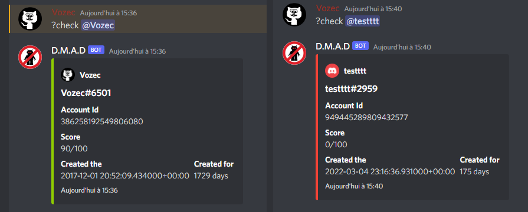
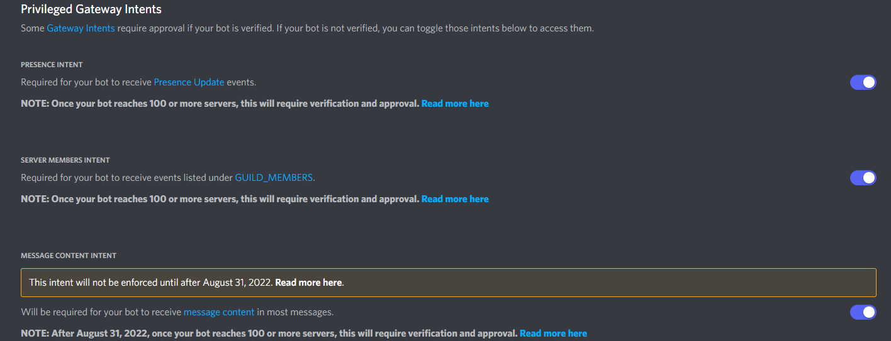
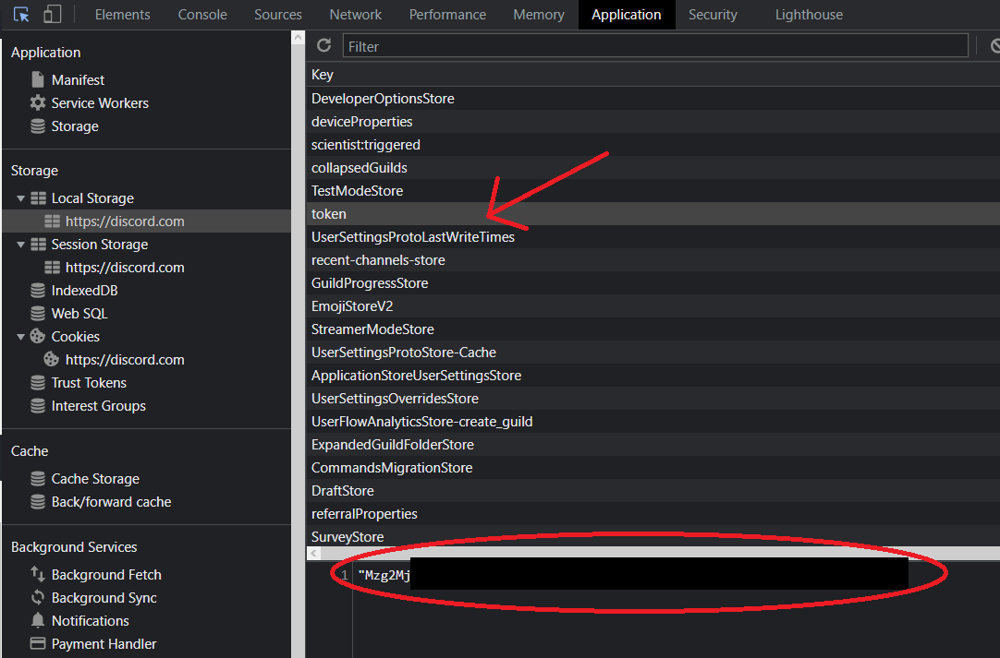
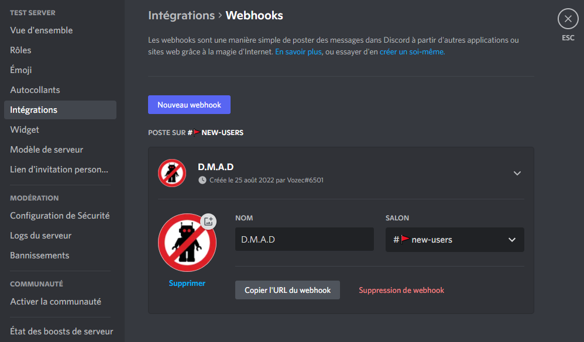
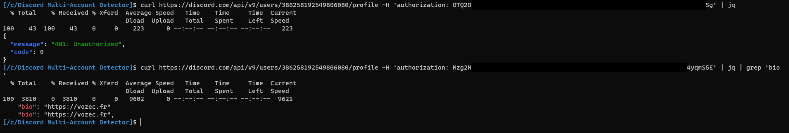

# Discord Multi-Account Detector
This discord bot is used to evaluate a **Safe-Score** from *0* to *100* for each account joining a server  


## How it's work ?
The Bot **scrape infos** about the new user and and assign more or less points depending on the results .  

All infos used are :
- Creation Date
- Activities
- Biography
- Accounts Linked
- Banner
- Color
- Profile Picture , Default ?
- Is on mobile ?
- Is Nitro ?
- Is on Web version ?

*(The command ``?check @user`` also allows the analysis of a targeted profile)*

## Installation
- ```bash
  cd ~
  git clone https://github.com/Vozec/Discord-Multi-Account-Detector.git
  cd Discord-Multi-Account-Detector
  python3 -m pip install -r requirements.txt
  ```
- Edit the ``config.json`` file

### Example: config.json
```json
{
	"TOKEN_BOT":"OTQ2OD ... Sg",
	"TOKEN_USER":"Mzg2M ... 4yqmS5E",
	"PREFIX":"?",
	"DESCRIPTION":"Discord Multi-Account Detector",
	"WEBHOOK":"https://discord.com/api/webhooks/101239346 ... 8569354/PLuCEhNywE_U3W_XJCDyQbIb6UPWY9Sc ... 4OC7"
}

```

### Where can i find the ``TOKEN_BOT``:
- Go [here](https://discord.com/developers/applications) and create a ``application``
- Activate ``Intents`` and Copy the ``TOKEN`` in the ``BOT`` section
- Create a server on discord and invit your bot using the ``URL generator`` *(OAuth2 section)*


### Where can i find the ``TOKEN_USER``:
- Go [here](https://discord.com/app) and ``login``
- Open DevTools *(Ctrl+Shift)* and go in ``Application`` section
- Copy the ``token`` cookie


### Where can i find the ``WEBHOOK``:
- Go in your ``Discord server setup`` and *Webhooks* section
- Create one a setup all :
  - Name
  - Profile Picture
  - Channel were message will be send



### Note : Why user token is needed ?
You may wonder why a user token is needed :
Discord prevents access to certain information from a bot , including a user's biography and linked accounts.This is why it is necessary to use a classic account to retrieve this information and have a more precise result.

The bot can work without the user token but the result will not be based on the description and the accounts linked to the profile. (Much Less Accurate)



*Vozec*
